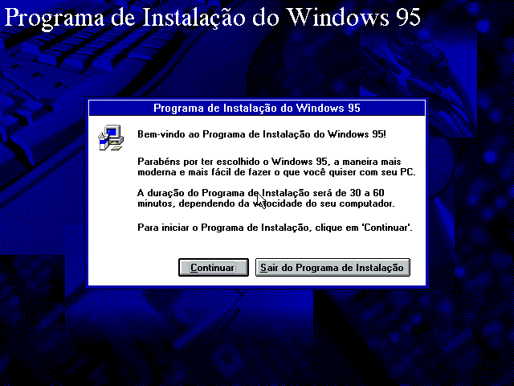

Demorei muito para sair do MS-DOS e começar a usar o Windows 3.1.

De fato, quando comecei a usar a internet, ainda tínhamos o Windows 3.1 instalado em nosso velho 486.

Por este motivo, também demorei para sair do Windows 3.1 e começar a usar o Windows 95.

# O Desenvolvimento

De codinome Chicago, o Windows 4.0 recebeu o nome comercial de Windows 95, ano de seu lançamento oficial.

Os requisitos mínimos para rodar o Windows 95 eram bem modestos, precisando apenas de um processador 386DX, 4 MB de RAM, 55 MB de espaço em disco e uma unidade de disquete para ler as 13 unidades necessárias para a instalação.

Esta configuração, embora modesta já em 1995, era muito comum em 1992, ano em que o desenvolvimento do Windows 95 começou (e que foi logo após o lançamento do Windows 3.1).

Uma curiosidade aqui é que o Windows 95 instalava diferentes arquivos para computadores com 4 MB ou 8+ MB de RAM, o que significa que depois de instalado, somente um upgrade de memória não era o suficiente para aproveitar todo o potencial do sistema, sendo necessário reinstalar o Windows.

# O Lançamento

Naquela época, acompanhávamos os lançamentos pelos jornais e televisão.

Foi um evento marcante. O sistema prometia ser revolucionário, e pessoas fizeram filas para comprá-lo.

Isso acabou rendendo boas e icônicas fotos, como aquela de Mikol Furneaux, um australiano segurando 2 caixas do sistema à meia noite do dia 24 de agosto de 2025, data do lançamento em Sydney, Austrália.

Vários eventos e coisas grandiosas foram planejados para o dia. Ninguém menos do que Jay Leno apresentou Bill Gates no evento de lançamento em Redmond, Washington.

E vejam quantas cópias este carinha, então com 11 anos, estava levando para casa.

Mas a primeira pessoa a comprar o Windows 95 foi supostamente Jonathan Prentice, então com 19 anos, da Nova Zelândia.

Foi criado até um vídeo - distribuído em VHS - onde Jennifer Aninston e Matthew Perry, na época partes do elenco de Friends, apresentavam o Windows 95.

Mas tudo isso foi "pros lados de lá".
Por aqui continuávamos com nosso bom e velho Windows 3.1.

Tive poucos contatos com o Windows 95 nos computadores da escola, pois naquela época, informática em escolas era algo raro, então não tivemos muitas aulas com interações com computadores.

Me lembro de usar o WordPad em algumas aulas e o MS Paint em outras.

Já conhecia o Paintbrush do Windows 3.1, mas o MS Paint era diferente.

# Enfim ele chega

Eventualmente o Windows 95 chegou em casa. Lembro que meu pai não gostou dele de início, e sempre que ligava o computador ia direto em "Reiniciar o computador em modo MS-DOS", entrava no diretório do Windows 3.1 e rodava o comando `win` .

Minha mãe não usava muito o computador, e quando usava, era no sistema em que estivesse rodando mesmo.

Mas meus irmãos e eu gostamos. Ah se gostamos!
E junto do Windows 95, ainda ganhamos o jogo Lamgorghini American Challenge, aquele da Titus desenvolvido pro MS-DOS. Conto mais sobre ele em outro artigo.

A instalação do Windows 95 já era bem bonita, trazia aquele papel de parede com um teclado ergonômico Microsoft e a imagem de um CD. Tudo naquela imagem de fundo parecia mostrar que o futuro havia chego.

E permitia escolher o tipo de instalação.

E enquanto instalava o sistema, aproveitava para apresentar algumas novidades.

Aliás, este sistema de instalação deu bastante trabalho e rodou 3 sistemas diferentes. Se quiserem, conto mais sobre isso um dia.

Depois de um restart e de terminar de instalar os arquivos necessários, fomos agraciados com a tela de inicialização.

Estranhamente, quando o Windows 95 iniciou, o papel de parede não era o mesmo da instalação.

Ele ainda estava ali e podia ser selecionado, mas o papel de parede escolhido para receber os usuários era simplesmente um verde sólido em um tom que até hoje não sei como chamar.

Precisamos dizer que este sistema operacional foi fortemente inspirado no IBM OS/2, que na época era um sistema concorrente ao Windows. E também recebeu uns toques de Macintosh.

O visual ficou bacana, o botão Iniciar mudou completamente a forma de interagir com o sistema, e a barra de tarefas também. Tudo estava muito mais acessível ali na parte inferior da tela. O multitarefa estava mais evidente, e o sistema parecia mais amigável.

As janelas com tons de cinza e um toque 3D eram bem mais bonitas do que as do Windows 3.1 e conferiam um ar de modernidade ao sistema.

Além disso, este era um sistema 32-bit, o que permitia acessar endereços de memória em até 4 GB, embora o Windows 95 não fosse capaz de gerenciar tudo isso.

Também 4 GB era um valor muito alto para a época, considerando que a maioria dos computadores tinha entre 8 e 16 MB de RAM. Alguns tinham módicos 4 MB. E os discos rígidos raramente passavam dos 540 MB.

Outra novidade interessante era a Lixeira, que permitia recuperar arquivos apagados. Algo que hoje é algo padrão, mas que deu muito mais segurança pra usuários que precisavam fazer coisas sérias no computador.

Uma coisa que pouca gente se lembra é que durante a instalação, o Windows 95 perguntava qual seria o gerenciador de programas padrão: o novo Windows Explorer, ou o velho Program Manager do Windows 3.1.

Lembro que usamos por um tempo o Windows 95, mas eventualmente, após algum problema, ele deixou de funcionar e precisamos voltar ao Windows 3.1. Não me lembro ao certo o que aconteceu e nem quanto tempo ficamos sem ele, mas de certo voltamos ao Windows 95 algum tempo depois.

Sua interface, embora não fosse uma ideia original, caiu tanto no gosto das pessoas e se popularizou tanto, que anos mais tarde, quando a Microsoft tentou eliminar o botão Iniciar no Windows 8, houve uma revolta tão grande que a empresa teve que voltar atrás e reintroduzir o botão no Windows 8.1.

Hoje o Windows 95 parece um tanto datado, mas lá em 24 de agosto de 1995, quando foi lançado, estava prestes a ditar a forma como interagimos com computadores pelos próximos 30 anos. E quem sabe, pelos próximos 30 anos mais.

Os celulares com telas sensíveis ao toque têm interfaces que seguem conceitos diferentes, e que fazem muito mais sentido para o tamanho da tela e tipo de dispositivo, mas quando estamos no PC, ainda usamos o mesmo conceito de janelas, menus, botões e barras de tarefas criado lá atrás e popularizado pelo Windows 95.

Feliz aniversário, Windows 95! Foi muito bom conhecer você.
