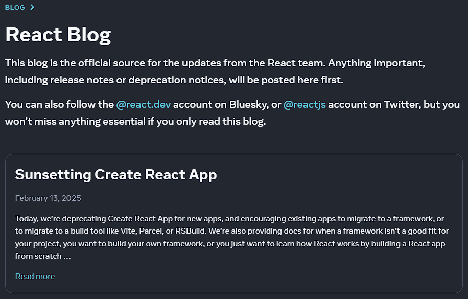
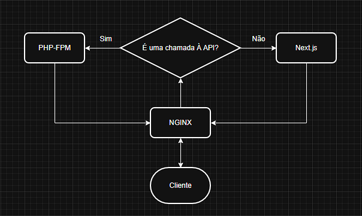

Fala, galerinha!

Queria escrever algo falando sobre como preciso escrever mais por aqui, mas para isso
pensei em uma repaginada neste site. Com isso, este post acaba de deixar de ser
uma reflexão de como deixei isso aqui de lado, e passou a ser sobre como o sistema
estava, seu estado atual e o que será dele daqui em diante.

Vocês devem imaginar que um sistema de 2021 que nunca tenha recebido atualizações
tenha algumas melhorias a serem feitas, mas não imaginam o quanto!

# História deste site

Este site foi criado em 2021 para eu poder contar minhas histórias e experiências
de uma forma bem informal, como em uma conversa de bar.

A ideia era me aprofundar na experiência em si,
e não em dados e assuntos técnicos - porém eventualmente talvez - para que a
leitura fosse mais rica e divertida.

O back-end foi aproveitado de outros projetos - mais sobre ele a seguir - e o layout,
muito simples, foi criado em uma tarde. Tinha somente o necessário para garantir a
leitura e navegação.

Site criado, algumas histórias contadas, o tempo passou e muita coisa aconteceu.
Está na hora de voltar.

# Algumas informações sobre o sistema

## Front-End

O front-end deste site era montado da forma clássica, com o HTML escrito em views
que eram retornadas pelo back-end para o navegador. Para adicionar responsividade
e facilitar as coisas eu usava o [Bootstrap](https://getbootstrap.com), que sempre me quebrou um galhão.

Está certo, sites que usam Bootstrap têm cara de Bootstrap. Mas com o layout praticamente
inexistente do site, acabava passando batido.

## Back-End
O back-end é um framework próprio escrito em PHP. Eu sei que esse tipo
de coisa não é recomendada, que é reinventar a roda e tudo o mais. Entendo que
o Laravel existe pra isso (não gosto do Laravel, prefiro Symfony. Assunto para outro artigo)
e todas as questões de segurança envolvidas.

O motivo de eu manter um framework próprio é poder testar e aplicar novas
funcionalidades e tecnologias lançadas a cada nova versão do PHP e aprender como
funcionam.

Dito isso, nem preciso dizer que de 2021 pra cá este framework mudou bastante. Não
só na questão de recursos, funcionalidades e como as coisas funcionam como também
estruturalmente.

# Início do novo projeto

A ideia inicial era atualizar o back-end para corrigir algumas falhas de segurança
e melhorar o desempenho geral do sistema, mas como o framework teve mudanças estruturais,
precisei refatorar as views (que eram poucas, somente 2 views para home e artigo). Neste processo, comecei a pensar em como talvez aquelas
views não fossem tão boas assim.

Elas estavam muito simples e não muito bonitas. As pessoas preferem ler artigos
em sites bonitos, então eu precisava de mais trabalho nelas.

Já que ia refatorar as views, e como eram somente duas, resolvi transformar esta
aplicação em uma SPA (single page application). Seria simples, bastava mudar a
resposta do back-end pra JSON e iniciar uma nova aplicação no React 19. Com toda certeza,
em uma tarde estaria tudo montado.

A escolha do React inclusive foi por eu ter trabalhado mais com ela do que com Vue
ou Angular. Queria algo rápido.

## Os problemas começam a aparecer

A ideia inicial era simples, mas como tudo na vida, as coisas nem sempre saem como
planejado.
A primeira coisa que eu fiz foi criar uma nova aplicação React com o [Create React App](https://create-react-app.dev/).

```
[mleandrojr@localhost ~]$ npx create-react-app@latest prosa-dev
```

Foi neste momento que recebi a primeira pedrada: o create-react-app, ou CRA para
os íntimos, está obsoleto (deprecated para os devs).

Para os que estão recebendo a bomba agora, existe [este post](https://react.dev/blog/2025/02/14/sunsetting-create-react-app)
no blog do React explicando a obsolecência e os motivos que levaram a isso.



Embora ainda fosse possível usar, eu realmente iria iniciar um refactor em cima
de algo que logo deixaria de receber suporte? Não me parecia um início muito bom
para o novo front-end.

Não existe somente o CRA para a criação de projetos React (e em resumo, foi por isso que resolveram descontinuá-lo),
e o [Vite](https://vitejs.dev/) daria conta facilmente do recado. Já o conhecia,
seria muito fácil trabalhar com ele.

## Mais surpresas

Aplicação criada no Vite, tudo funcionando, hora de começar a trabalhar no front-end.
A aplicação precisa de um sistema de rotas, senão não teria como abrir os artigos
para leitura.

Eu já havia trabalhado com o [react-router-dom](https://reactrouter.com/) e sabia
que ele serviria como uma luva para um projeto tão simples.
Na verdade, ele era até overpowered.

A segunda surpresa veio aí: o react-router-dom também já não existe mais! Ele agora
é o [react-router](https://reactrouter.com/), que no momento em que escrevo este artigo,
está na versão 7.4.0 (Ele iniciou na versão 7).

Lendo a documentação, descobri que ele pode trabalhar de 3 formas distintas
(se quiserem, posso falar sobre elas um dia), e uma delas é como framework.

Trabalhar em modo framework traria algumas vantagens sobre as outras duas, mas pra isso
eu precisaria criar um novo projeto.

A esta altura, eu já tinha aceitado a ideia de trabalhar com um framework, porém,
se iria partir pra este caminho, por que não então partir para um framework mais
usado no mercado?

## A escolha do Next.js

O Next.js é um framework React que traz uma série de funcionalidades, e uma que acho
particularmente interessante é o roteamento baseado em estrutura de diretórios.
Isso quer dizer que:
```
app/
  └── articles/
      └── page.js
```

É traduzido em:
`https://prosa.dev/articles` .

E suporta rotas dinâmicas também!
```
app/
  └── [article]/
      └── page.js
```
Ele permite inclusive a criação de diretórios que serão ignorados pelo router,
bastando envolvê-los em parêntesis.

A junção disso com a possilidade de aninhar arquivos de layout me permitiram criar
uma home diferentona, que durante a navegação será vista apenas uma vez pra não atrapalhar
a leitura dos artigos.

```
app/
  └── (internal)/
      ├── [article]/
      └── articles/
```

O roteamento baseado em estrutura de diretórios me permitiria criar a estrutura
da aplicação com muito mais agilidade, me deixando mais tempo para pensar na parte
visual e na experiência do usuário.

Eu já conhecia o Next.js, mas fazia muito tempo que não o visitava. Uma coisa que
descobri é que agora esses frameworks e bibliotecas estão com uma proposta full stack.

Isso quer dizer que o Next.js agora pode ser usado para desenvolver a parte da aplicação
que rodará no servidor - um servidor [Node.js](https://nodejs.org/) que é capaz
de fazer praticamente tudo o que uma aplicação web deve fazer.

Isso inclui comunicação com APIs, bancos de dados e o que mais você imaginar.

Apesar de já ter meu back-end e não ter pretensão de substituí-lo, resolvi testar
a criação de server components para ver como isso iria funcionar. Em vez de fazer leitura
em um banco de dados, faria chamadas à minha API e estaria tudo certo... ou quase isso.

Este processo criaria uma camada intermediária entre o front-end e o back-end. Um serviço a mais rodando,
um proxy pass a mais no nginx e o aumento de latência que isso causaria.

Pensem comigo: neste sistema, o navegador faria uma requisição para o servidor,
que a receberia no nginx e repassaria ao servidor do next.js.
Este, então, faria uma requisição à API solicitando os dados. Esta requisição novamente
passaria pelo nginx que então repassaria ao php-fpm.

O nginx é meu proxy reverso. Tudo deve passar por ele para que ele possa
fazer o balanceamento de carga, cache, direcionamento e outras coisas que ele faz.



Custoso sim, mas isso me daria a vantagem das SSRs (Server Side Rendering) e SSGs (Static Site Generation)
que o Next.js oferece, e que são muito boas para SEO (Search Engine Optimization).

Com isso, o Next geraria páginas renderizadas no servidor, com o HTML sendo entregue
ao cliente da mesma forma como meu framework PHP faria. Páginas renderizadas no servidor
são melhores para motores de busca, eles tendem a gostar mais.

## Aprender algo novo não é fácil

Apesar de ser oficialmente um dev full stack, passei muito tempo focado no back-end
e perdi o início dessa onda de frameworks JavaScript com SSR e SSG,
então ainda me perco um pouco no desenvolvimento do projeto.

Claro, entender as diferenças entre cliente e servidor e quando cada camada é executada
me ajudou muito.
Pra mim fica muito claro o motivo de não poder usar `useEffect` ou `useState` em um
componente de servidor, bem como por que não posso interagir com o banco de dados
em um componente do cliente. Não estou me referindo a isso.

Algumas coisas que aprendi no processo:

 - Trabalhar com componentes de cliente e servidor é simples, bastando usar um
`"use client"` ou `"use server"` no início do arquivo.

 - Podemos criar mais de um componente no mesmo arquivo e definir cada um deles como
componente de cliente ou de servidor, bastando colocar as
respectivas strings no início de cada função.

 - Um componente de cliente pode ter um componente de servidor como filho.
 Isso não fazia muito sentido na minha cabeça no início, mas agora acho que entendi.
 O componente de cliente receberá o HTML do componente de servidor como se fosse
 um HTML de um componente qualquer.

## Dificuldades no build

O esboço do novo front-end está pronto, e é este que você está vendo agora.
Ainda não tem muitos elementos visuais e nem está tão bonito, mas dê um desconto,
ele foi escrito em apenas uma tarde.

Com um MVP (Minimum Viable Product) pronto, era hora de fazer o build, e aí surgiu um problema.

O Next.js estava tentando criar páginas estáticas para cada um dos artigos, além
de uma página estática para a rota de artigos em si.

Isso era um problema, pois os artigos estão salvos em banco de dados e, apesar de
raramente acontecer, artigos podem receber atualizações.

Já pensaram ter que refazer o build só porque um artigo teve um typo corrigido?

Fora que a página de artigos também precisa ser dinâmica. Esta, na verdade, mais ainda,
pois a qualquer momento pode surgir um artigo novo.

Lendo a [documentação](https://nextjs.org/docs/app/api-reference/file-conventions/route-segment-config#dynamic) descobri a `const dynamic` que pode ser usada para definirmos
ou forçarmos um comportamento em um componente.

Com isso aqui no início do arquivo:
```javascript
export const dynamic = "force-dynamic";
```

Eu poderia dizer ao Next.js que quero que a página seja renderizada a cada acesso,
resolvendo meu problema com as rotas.

## Deploy

O Next.js foi desenvolvido pela [Vercel](https://vercel.com/), o que quer dizer que é otimizado para o
deploy por lá.

Eu não vou utilizar a Vercel pois já tenho meu servidor pra hospedar.

Como ele sobe um servidor Node.js, resolvi baixar o projeto no meu host, fazer
o build por lá mesmo e criar uma entrada no `systemd` para mantê-lo em pé.

Funcionou. E testando a navegação, o desempenho não me pareceu tão prejudicado.

## Próximos passos

O processo de envio de um artigo é manual. Eu escrevo o artigo em markdown, converto
pra HTML (é mais rápido do que escrever em HTML) e adiciono ao banco de dados.
Somente eu posto aqui, e isso até que não me incomoda.

Minha ideia é permitir que mais pessoas enviem artigos, então preciso automatizar o processo.

Estou pensando em algo como um CI/CD (Continuous Integration/Continuous Delivery) com o GitHub Actions.
A ideia é que um pull request com o artigo seja aberto em um repositório no GitHub,
e quando o pull request for aprovado, o GitHub Actions faça a adição.

Se partir pra isso, posso fazer com que o GitHub Actions faça o build e o deploy do projeto
a cada pull request, e aí sim poderei trabalhar com as páginas estáticas.

Ainda rolaria um novo build a cada edição de artigo, mas ele seria automático, então
pouco importa.

Pra que isso aconteça, estou bolando a estrutura do arquivo para adição de autores.

Por enquanto estou pendendo pro YAML, pois é simples, fácil de interpretar e suportará
todas as informações que estou pensando em adicionar.

Pensei no JSON também, mas visualmente ele não é tão agradável, além de ser mais verboso. YAML me pareceu uma
escolha melhor.

Já os artigos serão em markdown mesmo, com um pequeno cabeçalho onde serão adicionadas
categorias, tags, título e o username do autor.

Depois de definido isso tudo, quero continuar a criar os elementos visuais todos
que deixarão o site mais agradável e bonito. Talvez até criar um tema claro.
Hoje ele é escuro por padrão porque a maioria dos devs programa em tema escuro,
e não é legal sair deles pra do nada queimar a retina em um fundo (quase) branco.

Acho que é isso por enquanto. O novo site está no ar. Ainda é um MVP, mas permite
o principal, que é a leitura.

Em breve volto com mais novidades.
